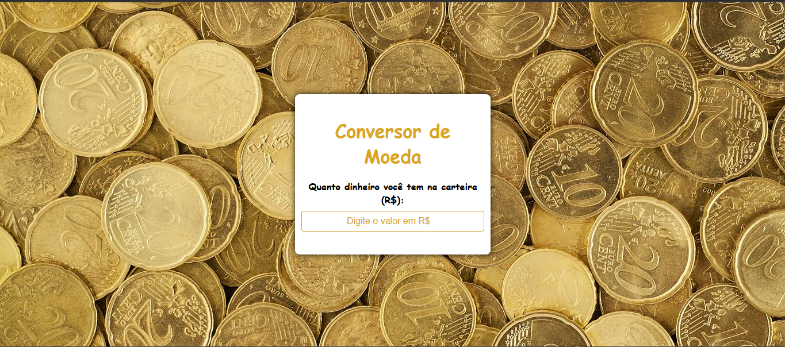

# Conversor_de_Moedas

Um site totalmente responsivo feito com HTML, CSS E JS. O objetivo dele é converter do real para dolar e euro, espero que o site te ajude!

OBS: Esterei sempre atualizando!

# License

