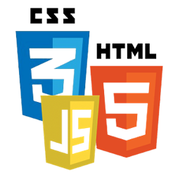
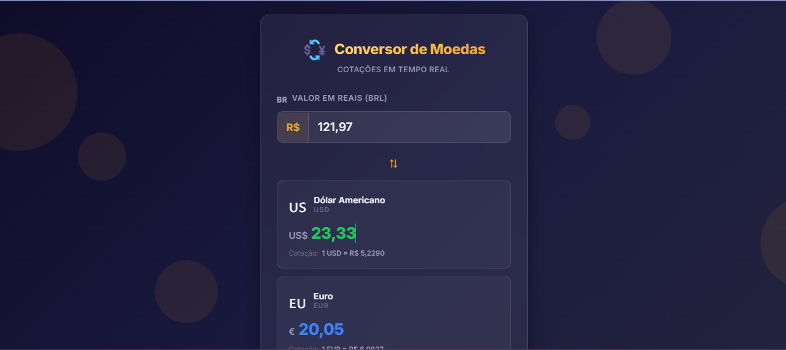

# Conversor de Moedas

Conversor de moedas em tempo real com cotações do Banco Central do Brasil (BCB). Converte entre Real (BRL), Dólar (USD) e Euro (EUR) de forma bidirecional, com interface responsiva feita em HTML, CSS e JavaScript. Ele atualiza os valores em tempo real, automaticamente a cada 5 minutos. Usei também um FallBack offline com taxas estimadas caso a API falhe.

## Link do projeto

## Demonstração

## License

