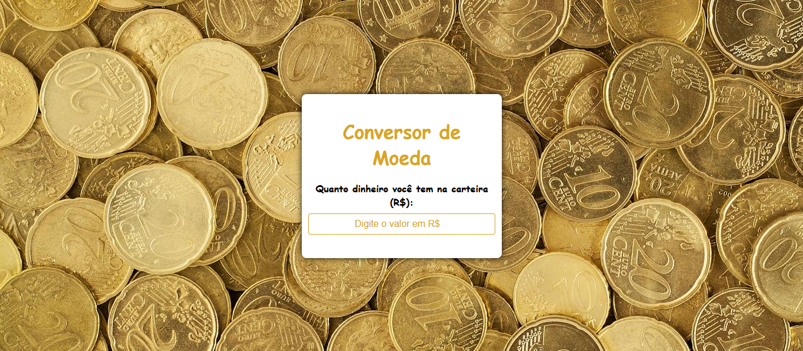

# Conversor de Moedas

Um site totalmente responsivo feito com HTML, CSS E JS. O objetivo dele é converter do real para dolar e euro, espero que o site te ajude! Esse era um código que eu já tinha em python, feito em um curso com Gustavo Guanabara e converti para JS.

OBS: Esterei sempre atualizando!

## Link do projeto

## Demonstração

## License

