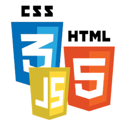

# Conversor de Moedas

Um site totalmente responsivo feito com HTML, CSS E JS. O objetivo dele é converter do real para dolar e euro, espero que o site te ajude! Esse era um código que eu já tinha em python, feito em um curso com Gustavo Guanabara e converti para JS.

OBS: Esterei sempre atualizando!

Esse é o link do meu projeto <a href= "https://anajulialeite.github.io/Conversor_de_Moedas/">Conversor de Moedas</a>

# License

